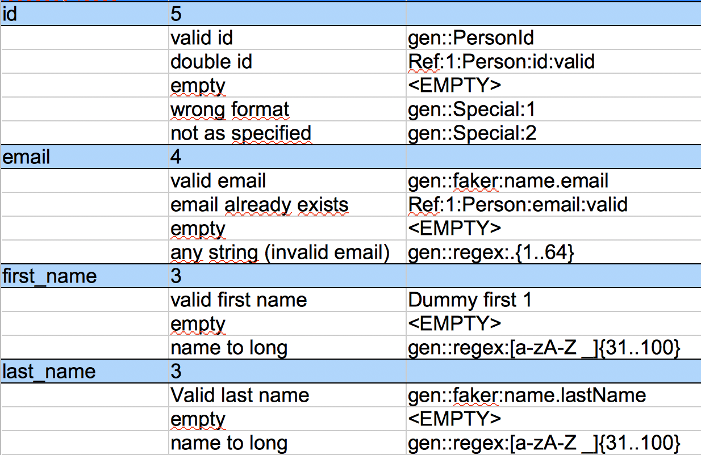

== Generator Command
In the generator section the user defines how to generate the data for a field.

.example from a decision table

=== Generator command
The generator is used to generate new data.

----
gen:<instanceId>:<generatorName>:<any Parameter>
----

InstanceId::
	The instance id is an internal id belonging to an instance of a given test case. If no id is given
	a uuid will be taken by the generator. The instance id allows the user to get the same data set from
	a generator on different fields. +
  For Example there is a generator which creates personal data.
	It will generate a 'firstName', 'lastName' and an email. But the data is needed in three different fields of the table.
	Each time the generator is called it usually creates a new set of data but this is not what we need in this case.
	We would rather retrieve data belonging to the same person.
  +
  Assume the data generator is named ''AdressDataGenerator'' and it has a parameter to tell which data to be returned.

----
gen:1:AdressDataGenerator:firstName  <1>

gen:1:AdressDataGenerator:lastName   <2>

gen:1:AdressDataGenerator:email      <3>
----
<1> The first call the generator will create a new set of data. The data
will be stores under the instanceId ''1'' And the data for the field ''firstName'' is
returned.
<2> The second call of the generator. The generator finds data for the instance id ''1''
and will not generator new data. Then it will return the data for ''lastName'' of the existing data set.
<3> The same as for 2.

The instanceId allows the user to call the same generator many times and retrieve access to
the same data if needed.
