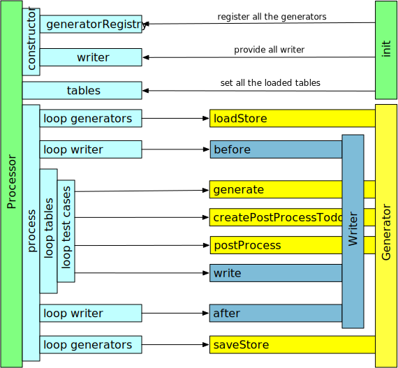

== Overview
The following image shows the interaction of the processor with the outside world.

Understanding the picture::
  The order of the arrows is the order in which the processor executes. The rectangles on
	the left side show the program flow in the processor. The arrows are interactions with
	the generators and writers provided.

=== Init
The init phase
is where the custom code sets up the processor.
You provide a generator registry with all the needed generators registered. Then you
provide an array with all the needed writers.

After loading all the spreadsheets you provide the table models as an array to the processor.
Now the processor is prepared to work.

=== Process
When the process function is called. The first thing is the setup of the generators and writers.

==== loadStore()
Loop over all the generators and call the 'loadStore()' function. This gives the generator the possibility
to setup the generators as needed. The load store function of the generator is only executed if the property
'useStore' is set to a true value.

==== writer.before()
Loop over all the writers and call the 'before()' function. So the writer could do some setup work.
Maybe some writers will write to a database and needs to setup the connection.

==== loop tables
After setup of the generators and writers the processor loops over all the tables. Each table can provide
a list of test cases to be executed.

==== loop test cases
Loop over all the test cases a table provides. Each test case is processed independently from each other.
The first thing is to generate the data. For this it is calling the 'generate' function of all the generators
defined in the test case. (It will also solve all the references. But as this is not an external interaction it
is not shown in this picture.)

Then the processor calls the 'createPostProcessTodo' function of all the generators defined in the test case. After that the
'PostProcessTodos' are executed. Now all the data for the test case should be created.

The next step is calling the the 'write()' function of all the provided writer.

==== saveStore()
Now all the data is generated and all the writers have exported the data in any format needed.

Loop over all the generators and call the 'saveStore()' function. This gives the generator the possibility
to store the already generated data for the next run.

==== writer.after()
Here the writer could tear down if needed.
