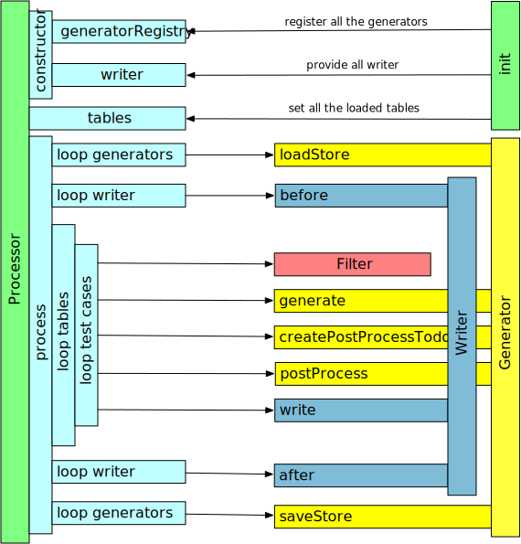

== Overview

The following diagram shows the interaction between the processor and external components.  
It illustrates the order in which the processor executes its tasks, along with the flow of data between the processor, generators, and writers.

Understanding the Picture:
* The order of the arrows indicates the sequence in which the processor executes its operations.
* The rectangles on the left represent the internal program flow within the processor.
* The arrows depict interactions with the external generators and writers.

=== Init

In the initialization phase, custom code sets up the processor. This involves:
* Providing a generator registry with all required generators registered.
* Supplying an array of writer objects that will be used to output the test case data.
* Loading all spreadsheets and converting them into table models.
  
After these steps, the processor is ready to begin processing.

=== Process

When the `process()` function is invoked, the processor goes through several steps:

==== loadStore()

* The processor iterates over all registered generators and calls their `loadStore()` method.
* This allows each generator to initialize or load stored data if its `useStore` property is true.

==== writer.before()

* The processor loops over all writer objects and calls their `before()` method.
* This step allows writers to perform any necessary setup (e.g., establishing database connections).

==== Loop Tables

* The processor iterates over all provided table models.
* Each table supplies a list of test cases that are to be executed.

==== Loop Test Cases

* For each test case provided by a table, the processor processes it independently.
* The processing of a test case involves:
  - Calling the `generate()` method of all generators defined in the test case to produce data.
  - Resolving all references (internally) within the test case.
  - Calling `createPostProcessTodos()` on each generator to prepare additional processing tasks.
  - Executing all gathered postprocessing todos to finalize the data for the test case.
  - Finally, calling the `write()` method on all writer objects to export the generated data.

==== saveStore()

* Once all test case data has been generated and written, the processor iterates over all generators again and calls their `saveStore()` method.
* This allows generators to store or cache the generated data for future runs.

==== writer.after()

* In the final step, the processor calls the `after()` method on all writer objects.
* This step allows writers to perform any necessary teardown or cleanup operations.

This comprehensive flow ensures that the processor sets up its components, generates and processes test case data, and finally exports the data in the required format.
