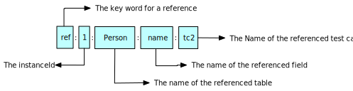
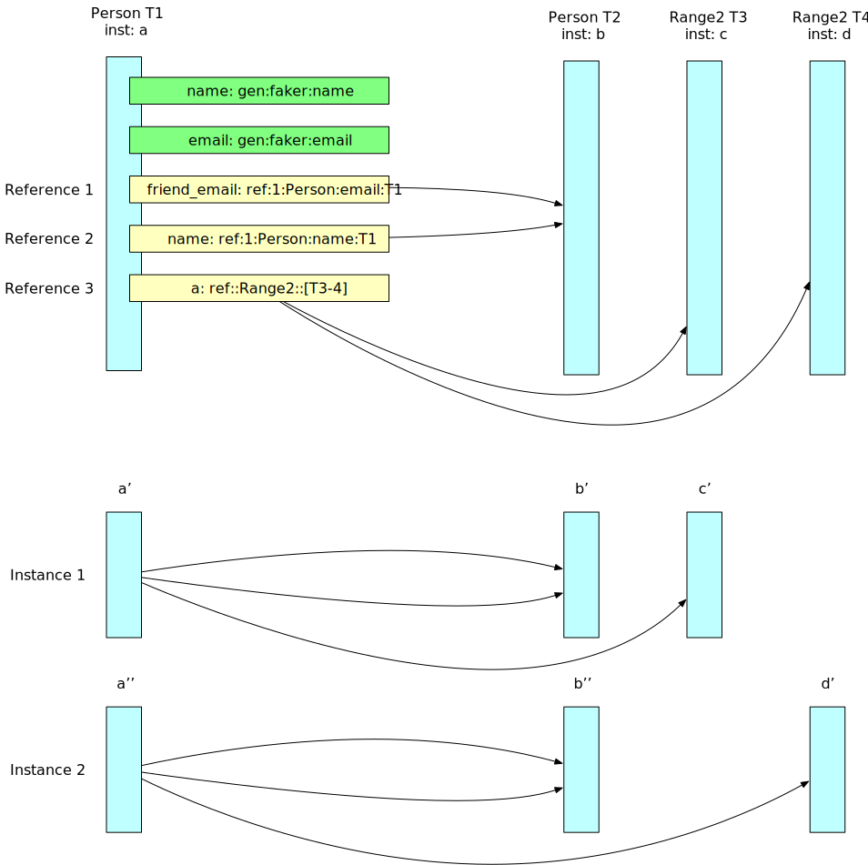

== Reference

A reference points to another test case in the same table or a different table. Each time a reference is resolved, a new instance of the referenced test case is created. Furthermore, a reference can target a range of test cases—in which case, for every test case in the range, the calling test case is duplicated.

=== Syntax of a Reference

The following images illustrate the syntax of a reference command:

A reference command generally follows this structure:

----
ref:<instanceIdSuffix>:<targetTableName>:<targetFieldName>:<targetTestcaseName>
----

* For a range reference, the command is enclosed in square brackets. In the example above, the reference points to test cases "tc2", "tc3", and "tc4".

=== Self Reference

A self reference points to another field within the same test case. This is common, for example, in a registration form where the "confirm password" field must match the "password" field.

.Field password2
----
ref::Person:password:
----

[NOTE]
For a self reference, both the test case name and the instanceIdSuffix should be omitted.

You can also omit the table name:
----
ref:::password:
----

=== Range Reference

A normal reference does not affect the calling test case. However, when a reference specifies a range, the processor creates a separate instance of the calling test case for each test case in the range.

The following diagram illustrates how a range reference is resolved:

For example, consider test case "T1" in the table "Person" with three references:

* **Reference 1:**  
  Points to the "email" field of test case "T2" in table "Person" with instanceId "1".  
  The generator creates a new data set for "T2" under instanceId "1" and returns the value for "email".

* **Reference 2:**  
  Points to the same target as Reference 1 but to a different field ("name").  
  Since both references use the same instanceId "1", no new instance is created; both refer to the same data set.

* **Reference 3:**  
  Points to table "Range2" with a target test case range "T3-4".  
  This means that the processor must create two instances of test case "T1" (e.g., labeled "a" and "a'") to resolve the reference.  
  For range references, the instanceIdSuffix must be omitted.

=== Default Values in References

* **Table Name:**  
  If omitted, the processor assumes the reference belongs to the current table.

* **InstanceId:**  
  If not provided, each reference creates a new instance of the target test case.

* **Field Name:**  
  If omitted, no data is included from the referenced field.

* **Test Case Name:**  
  This value is mandatory.
